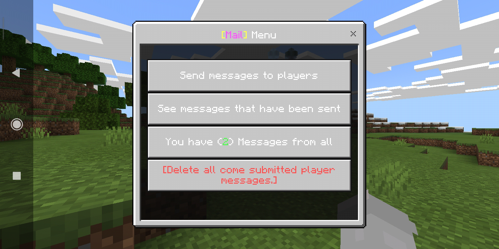
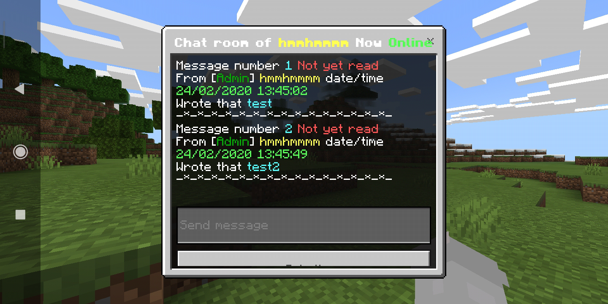
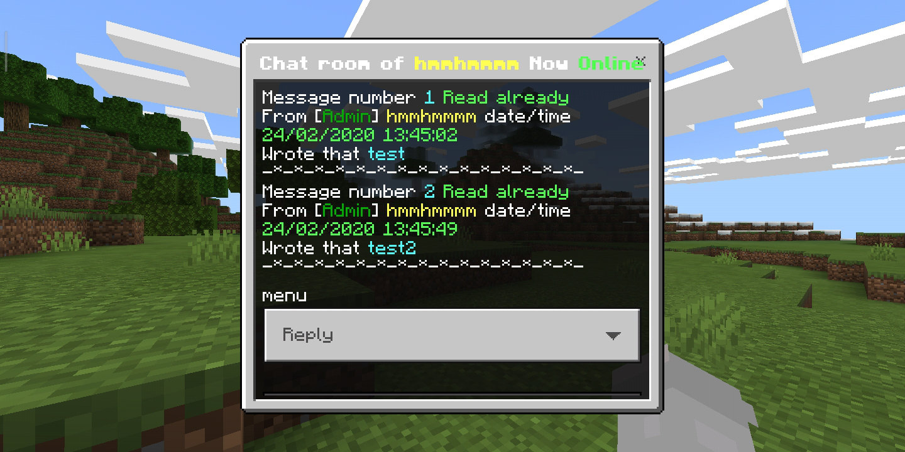
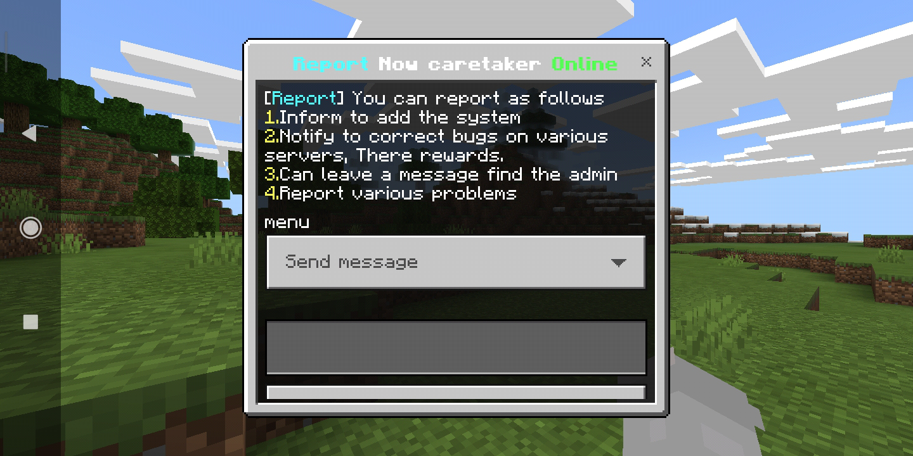
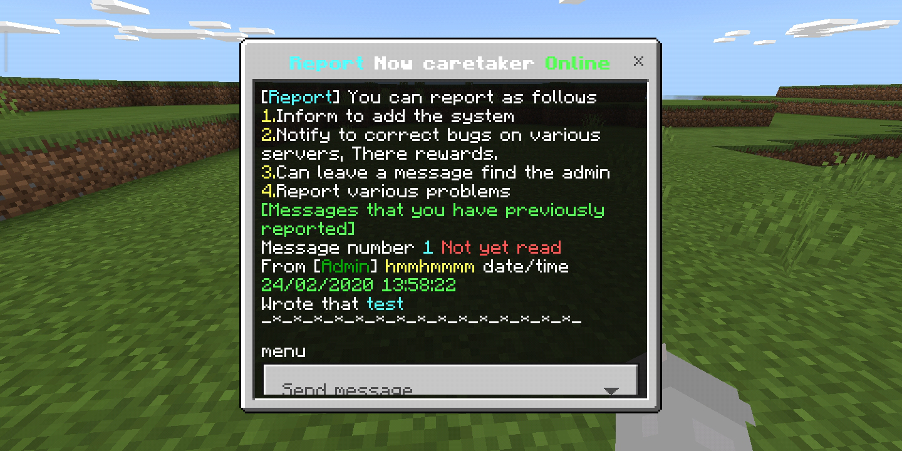

## MailPlugin
[](https://poggit.pmmp.io/p/MailPlugin)

[Thai](#thai)

[English](#english)


# Thai

```diff
- ปลั๊กอินนี้จะไม่ทำงาน หากคุณไม่ได้ลงปลั๊กอิน FormAPI
```

#Dowload Plugin FormAPI [Click here](https://poggit.pmmp.io/p/FormAPI)


**คุณสมบัติปลั๊กอิน**<br>
- เป็นปลั๊กอินส่งข้อความหาผู้เล่น (สามารถส่งข้อความแบบออฟไลน์ได้)
- สามารถดูข้อความที่เราส่งไปหาผู้เล่นว่า เค้าอ่านรึยัง?
- สามารถเก็บข้อความและลบข้อความได้
- มี gui form
- มี report
- มีภาษา thai english (สามารถแก้ไขภาษาที่คุณไม่ชอบได้ที่/resources/language)


**วิธีใช้งาน**<br>
- คลิปตัวอย่าง [คลิก](https://youtu.be/BML6U6NXe4E)


**Config**<br>
```
#Language
#>thai=ภาษาไทย
#>english=English language
language: thai


#ชื่อผู้เล่นที่จะรับข้อความ report
report:
  name: HmmHmmmm
```


**Command**<br>
- /mail : เปิด gui form
- /mail info : เครดิตผู้สร้าง
- /mail write <ชื่อผู้เล่น> : แล้วพิมที่แชทเขียนข้อความเพื่อส่งข้อความให้ผู้เล่นคนนั้น
- /mail read <ชื่อผู้ที่ส่งข้อความ> : อ่านข้อความผู้ที่ส่งมา
- /mail read-all : อ่านข้อความผู้ที่ส่งมาทั้งหมด
- /mail clear <ชื่อผู้ที่ส่งข้อความ> <หมายเลขข้อความ> : เพื่อลบข้อความนั้น
- /mail clear-all : เพื่อลบข้อความของผู้ที่ส่งมาทั้งหมด
- /mail see <ชื่อผู้เล่น> : เพื่อดูข้อความที่เราส่งไปว่าเค้าอ่านรึยัง?
- /report : แจ้งแอดมิน


**API**<br>
```php
<?php

namespace hmmhmmmm\mail;

interface MailAPI{

   /*
   * ตัวเชื่อมต่อ API
   *
   * @ return Mail
   */
   public static function getInstance(): Mail;
   
   /*
   * API รับจำนวนข้อความของผู้เล่นที่มีอยู่ทั้งหมด
   * วิธีใช้ Mail::getInstance()->getCountMail($player->getName())
   *
   * @ return int
   */
   public function getCountMail(string $name): int;
}
```


## Images











## LICENSE
ใบอนุญาต GPL-3.0 [license](https://github.com/HmmHmmmm/MailPlugin/blob/master/LICENSE)


# English

```diff
- This plugin will not work. If you don't have the plugin installed FormAPI
```

#Dowload Plugin FormAPI [Click here](https://poggit.pmmp.io/p/FormAPI)


**Features of plugin**<br>
- Is a plugin send message find players (Can send messages offline have)
- Can see my messages that sent to players, See if he read it?
- Can store messages and delete messages
- have gui form
- have report
- Have language thai,english (You can edit the language you don't like at/resources/language)


**How to use**<br>
- Sample clip [click](https://youtu.be/BML6U6NXe4E)


**Config**<br>
```
#Language
#>thai=ภาษาไทย
#>english=English language
language: thai


#Name of players who will receive messages report
report:
  name: HmmHmmmm
```


**Command**<br>
- /mail : open gui form
- /mail info : Creator credit
- /mail write <Player name> : And type in chat to send a message to that player
- /mail read <Name player who sent message> : Read the messages of players that have been submitted.
- /mail read-all : Read the messages of players that have been submitted All.
- /mail clear <Name player who sent message> <Message number> : To delete that message
- /mail clear-all : To delete all submitted player messages
- /mail see <Player name> : See my messages, Did he read it?
- /report : Notify administrator


**API**<br>
```php
<?php

namespace hmmhmmmm\mail;

interface MailAPI{

   /*
   * Connector API
   *
   * @ return Mail
   */
   public static function getInstance(): Mail;
   
   /*
   * API Receive the number of messages of all existing players.
   * How to use Mail::getInstance()->getCountMail($player->getName())
   *
   * @ return int
   */
   public function getCountMail(string $name): int;
}
```


## Images


## LICENSE
License GPL-3.0 [see](https://github.com/HmmHmmmm/MailPlugin/blob/master/LICENSE)