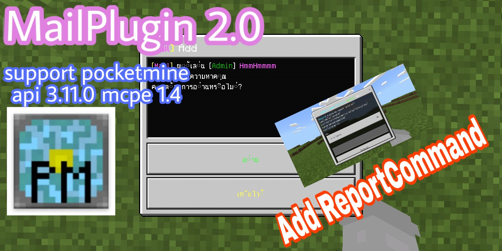

```diff
- ปลั๊กอินนี้จะไม่ทำงาน ถ้าคุณไม่ได้ลงปลั๊กอิน FormAPI
```
#Dowload Plugin FormAPI [Click here](https://poggit.pmmp.io/p/FormAPI)


**คุณสมบัติปลั๊กอิน**<br>
- มี gui form
- มี report
- เป็นปลั๊กอินส่งข้อความหาผู้เล่น (สามารถส่งข้อความแบบออฟไลน์ได้)
- สามารถดูข้อความที่เราส่งไปว่า อ่านรึยัง?


**วิธีใช้งาน**<br>
- คลิปตัวอย่าง เวอร์ชั่น 1.0 [คลิก](https://youtu.be/1GYqwORPJQg)
- คลิปตัวอย่าง เวอร์ชั่น 2.0 [คลิก](https://youtu.be/BML6U6NXe4E)


## ดาวโหลด
| version  | plugin support                        | Download  zip/phar                                                 |
| ---- | ------------------------------------ | ---------------------------------------------------------- |
| 1.0  | GenisysPro api 3.0.1 mcpe 1.1 [Click here](https://github.com/GenisysPro/GenisysPro) | [คลิก](https://github.com/HmmHmmmm/MailPlugin/releases/1.0) |
| 2.0  | pocketmine api 3.11.0 mcpe 1.14 [Click here](https://github.com/pmmp/PocketMine-MP) | [คลิก](https://github.com/HmmHmmmm/MailPlugin/releases/2.0) |
| 2.1  | pocketmine api 3.11.0 mcpe 1.14 [Click here](https://github.com/pmmp/PocketMine-MP) | [คลิก](https://github.com/HmmHmmmm/MailPlugin/releases/2.1) |


**API**<br>
- Mail::getInstance()::getCountMail(string $playerName) #ดูเลขข้อความที่มีอยู่ทั้งหมด


**Config**<br>
```
#ชื่อผู้เล่นที่จะรับข้อความ report
report:
  name: HmmHmmmm
```


**Command**<br>
- /mail : เปิด gui form

- /mail info : เครดิตผู้สร้าง
- default: op

- /mail write <ชื่อผู้เล่น> : แล้วพิมที่แชทเขียนข้อความเพื่อส่งข้อความให้ผู้เล่นคนนั้น
- default: true

- /mail read <ชื่อผู้ที่ส่งข้อความ> : อ่านข้อความผู้ที่ส่งมา
- default: true

- /mail read-all : อ่านข้อความผู้ที่ส่งมาทั้งหมด
- default: true

- /mail clear <ชื่อผู้ที่ส่งข้อความ> <หมายเลขข้อความ> : เพื่อลบข้อความนั้น
- default: true

- /mail clear-all : เพื่อลบข้อความของผู้ที่ส่งมาทั้งหมด
- default: true

- /mail see <ชื่อผู้เล่น> : เพื่อดูข้อความที่เราส่งไปว่าเค้าอ่านรึยัง?
- default: true

- /report : แจ้งแอดมิน
- default: true
