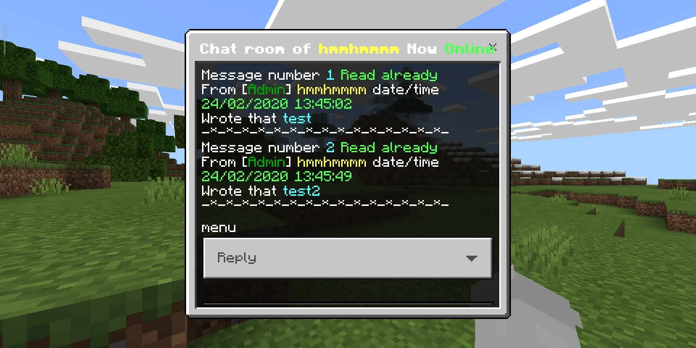
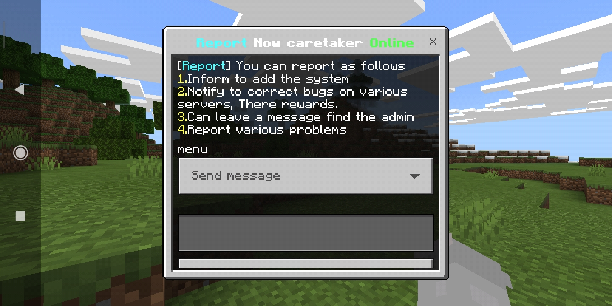

## MailPlugin

[Thai](README.md)
[English](README_EN.md)


## Language English

```diff
- This plugin will not work. If you don't have the plugin installed FormAPI
```

#Dowload Plugin FormAPI [Click here](https://poggit.pmmp.io/p/FormAPI)


**Features of plugin**<br>
- Is a plugin send message find players (Can send messages offline have)
- Can see my messages that sent to players, See if he read it?
- Can store messages and delete messages
- have gui form
- have report
- Have language thai,english (You can edit the language you don't like at/resources/language)


**How to use**<br>
- Sample clip [click](https://youtu.be/BML6U6NXe4E)


## Download
| version  | plugin support                        | Download  zip/phar                                                 |
| ---- | ------------------------------------ | ---------------------------------------------------------- |
| 1.0  | GenisysPro api 3.0.1 mcpe 1.1 [Click here](https://github.com/GenisysPro/GenisysPro) | [click](https://github.com/HmmHmmmm/MailPlugin/releases/1.0) |
| 2.0  | pocketmine api 3.11.0 mcpe 1.14 [Click here](https://github.com/pmmp/PocketMine-MP) | [click](https://github.com/HmmHmmmm/MailPlugin/releases/2.0) |
| 2.1  | pocketmine api 3.11.0 mcpe 1.14 [Click here](https://github.com/pmmp/PocketMine-MP) | [click](https://github.com/HmmHmmmm/MailPlugin/releases/2.1) |
| 3.0  | pocketmine api 3.11.0 mcpe 1.14 [Click here](https://github.com/pmmp/PocketMine-MP) | [click](https://github.com/HmmHmmmm/MailPlugin/releases/3.0) |


**Config**<br>
```
#Language
#>thai=ภาษาไทย
#>english=English language
language: thai


#Name of players who will receive messages report
report:
  name: HmmHmmmm
```


**Command**<br>
- /mail : open gui form
- /mail info : Creator credit
- /mail write <Player name> : And type in chat to send a message to that player
- /mail read <Name player who sent message> : Read the messages of players that have been submitted.
- /mail read-all : Read the messages of players that have been submitted All.
- /mail clear <Name player who sent message> <Message number> : To delete that message
- /mail clear-all : To delete all submitted player messages
- /mail see <Player name> : See my messages, Did he read it?
- /report : Notify administrator


**API**<br>
```php
<?php

namespace hmmhmmmm\mail;

interface MailAPI{

   /*
   * Connector API
   *
   * @ return Mail
   */
   public static function getInstance(): Mail;
   
   /*
   * API Receive the number of messages of all existing players.
   * How to use Mail::getInstance()->getCountMail($player->getName())
   *
   * @ return int
   */
   public function getCountMail(string $name): int;
}
```


## Images






## LICENSE
License GPL-3.0 [see](https://github.com/HmmHmmmm/MailPlugin/blob/master/LICENSE)